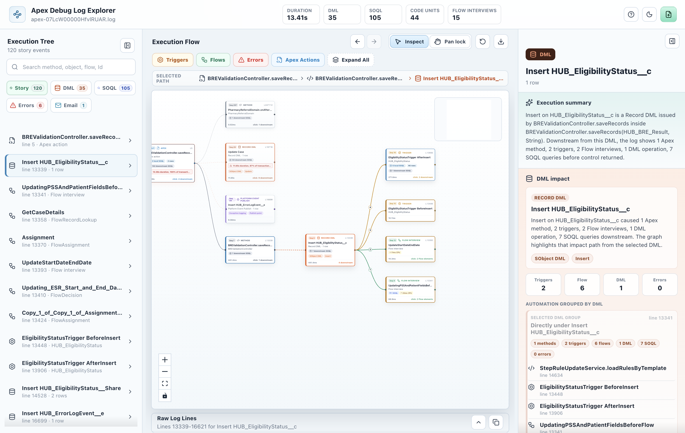
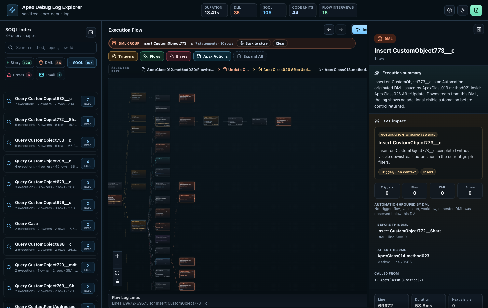
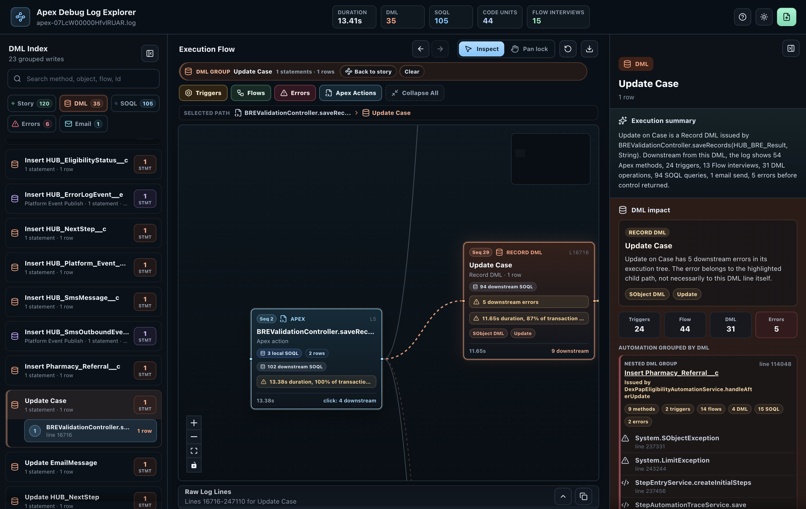
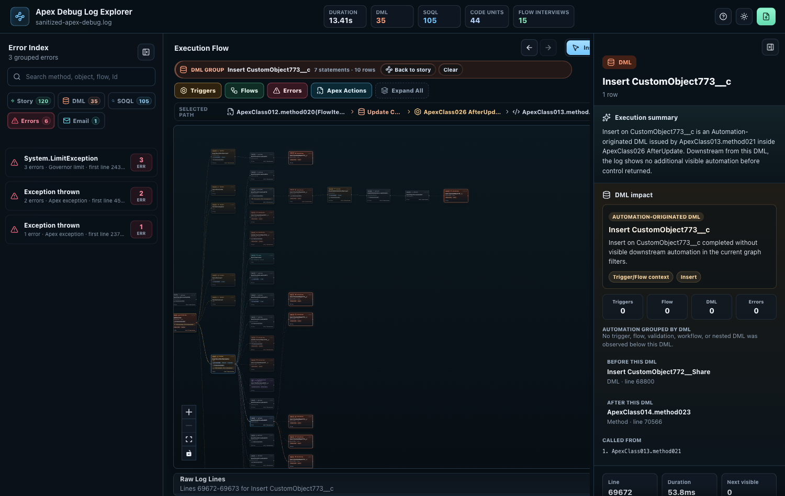
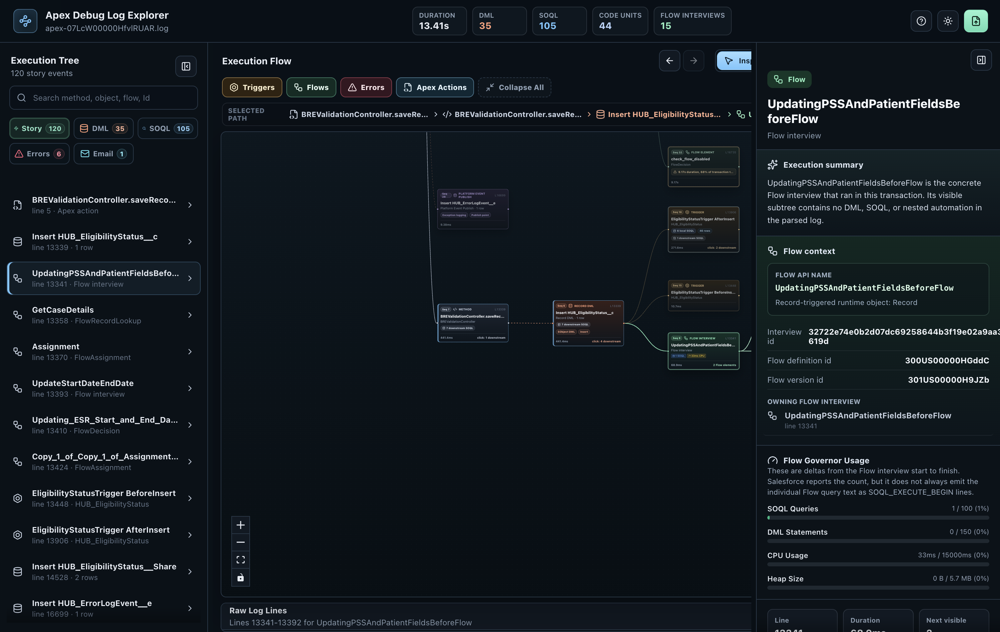

# Apex Debug Log Explorer

Apex Debug Log Explorer is a local-first desktop and VS Code tool for reading Salesforce Apex debug logs as an interactive execution graph instead of a flat wall of text.


## What It Does

- Builds a transaction graph from Salesforce debug logs.
- Shows Apex, triggers, Flow interviews, Flow elements, DML, SOQL, errors, Async Apex, email sends, and callouts in context.
- Lets you click a node to inspect downstream execution, caller context, raw evidence, governor metrics, and exception details.
- Groups DML, SOQL, errors, email sends, and callouts into left-panel indexes that jump back to the exact graph node where they happened.
- Highlights repeated SOQL and DML patterns without flooding the graph with hundreds of duplicate nodes.
- Keeps parsing local to your machine. Logs are not uploaded to Salesforce, OpenAI, or any other service.

## How It Differs From Existing Tools

Existing Salesforce log tools are useful, but they usually make you alternate between dense text, event tables, flame charts, and source code. Apex Debug Log Explorer focuses on the architectural question a production support engineer or Salesforce architect usually asks first:

> What happened before this DML, SOQL, email, callout, or exception, and what did it trigger downstream?

Compared with Apex Log Analyzer-style tools recommended in the Salesforce developer ecosystem, this project emphasizes:

- graph-first cause-and-effect navigation
- DML/SOQL/error/email/callout indexes tied to exact execution nodes
- Flow interview vs Flow element distinction
- downstream expansion from any node
- raw log evidence attached to each selected node
- local-first desktop and VS Code workflows

Compared with Apex Replay Debugger, this is not a breakpoint debugger. It is an after-the-fact transaction explorer for debug logs that already exist.

## Core Views

### Execution Graph

Navigate the transaction visually. Expand downstream execution from the node you care about and keep context as you move through Apex, triggers, Flow, async work, DML, SOQL, and exceptions.



### SOQL Index

Find repeated queries, group identical SOQL, and jump back to every execution node where that query happened.



### DML Downstream

See which DML operation caused triggers, Flow interviews, validation, async work, or downstream automation.



### Error Path

Open an error from the index, focus the exact node where it happened, and inspect exception details with raw evidence.



### Flow Interviews And Elements

Separate the actual Flow interview from the individual Flow elements inside it, so the graph does not imply that runtime wrapper lines are meaningful business steps.



All public screenshots are generated from sanitized debug logs using placeholder names such as `ApexClass`, `CustomObject`, `FlowItem`, and `BusinessToken`.

## Run From Source

```bash
npm install
npm run dev -- --port 5173
```

Open `http://127.0.0.1:5173/`, then upload a `.log` or `.txt` Salesforce debug log.

## Desktop App

```bash
npm install
npm run desktop
```

The Electron shell opens logs through a native file dialog and still keeps all processing local.

## Package Desktop Builds

```bash
npm run package:mac
npm run package:win
npm run package:linux
```

Installers are written to `release/desktop/`.

- macOS: `npm run package:mac` creates a `.dmg` for the current Mac architecture.
- Windows: `npm run package:win` creates an NSIS `.exe` installer. For public release builds, use the GitHub Release workflow so the Windows installer is built on a Windows runner.
- Linux: `npm run package:linux` is available for source users, but the initial public release focuses on macOS and Windows installers.

macOS builds are ad-hoc signed for private distribution. They are not Apple-notarized yet, so macOS may still show an unidentified developer or quarantine warning. Windows builds may show Microsoft Defender SmartScreen until the app is code signed and has reputation.

See `docs/packaging/desktop-installers.md` for the release packaging flow and signing notes.

## VS Code Extension

Install from Marketplace after publishing:

```bash
code --install-extension penna-vibe-code-apps.apex-debug-log-explorer
```

Marketplace page:

https://marketplace.visualstudio.com/items?itemName=penna-vibe-code-apps.apex-debug-log-explorer

Build a local `.vsix` package:

```bash
npm install
npm run vscode:package
```

Install from VSIX:

1. Download or build `apex-debug-log-explorer-<version>.vsix`.
2. Open VS Code.
3. Open Command Palette.
4. Run `Extensions: Install from VSIX...`.
5. Select the `.vsix`.
6. Open a Salesforce debug `.log` or `.txt` file.
7. Right-click inside the editor and choose `Open with Apex Debug Log Explorer`.
8. You can also right-click the file in VS Code Explorer and choose `Open with Apex Debug Log Explorer`.
9. Or run `Apex Debug Log Explorer: Open Log` from Command Palette.

Command-line install:

```bash
code --install-extension release/apex-debug-log-explorer-0.1.1.vsix
```

After installation, the extension opens supported logs from the editor context menu, the Explorer context menu, or Command Palette.

See `docs/publishing/vscode-marketplace.md` for publisher setup and Marketplace release steps.

## GitHub Release Checklist

1. Update `CHANGELOG.md`.
2. Capture fresh screenshots into `docs/media/`.
3. Create a version tag:

```bash
git tag v0.1.1
git push origin v0.1.1
```

The release workflow builds desktop artifacts and the VS Code `.vsix`, then creates a GitHub Release using `docs/releases/v0.1.1.md`.

The release artifacts include:

- `apex-debug-log-explorer-<version>-mac-x64.dmg`
- `apex-debug-log-explorer-<version>-mac-arm64.dmg`
- `apex-debug-log-explorer-<version>-win-x64.exe`
- `apex-debug-log-explorer-<version>.vsix`

## Development Notes

- React + TypeScript + Vite frontend.
- Electron desktop shell.
- VS Code webview extension.
- Parser runs in a Web Worker when available, with a main-thread fallback for restricted webview environments.
- No Salesforce org login is required.
- No cloud processing is used.

## Known Limitations

- The visualization depends on what Salesforce emitted in the debug log.
- Truncated logs can omit downstream details.
- This release does not include AI suggestions.
- This release does not connect directly to Salesforce orgs.
