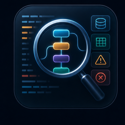
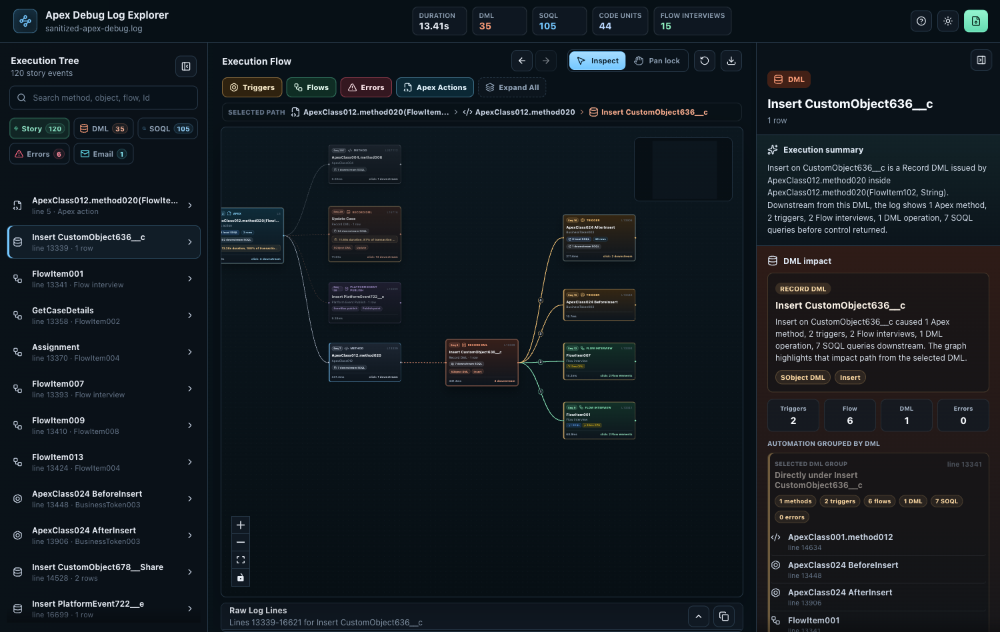

# Apex Debug Log Explorer v0.1.1





## What It Does

Apex Debug Log Explorer turns Salesforce Apex debug logs into an interactive execution graph. It helps you follow a transaction from Apex entry point to DML, triggers, Flow interviews, SOQL, Async Apex requests, email sends, callouts, and exceptions.

## Install: Desktop App

### macOS

Download the right DMG for your Mac:

- Apple Silicon: `apex-debug-log-explorer-0.1.1-mac-arm64.dmg`
- Intel Mac: `apex-debug-log-explorer-0.1.1-mac-x64.dmg`

Open the DMG, drag **Apex Debug Log Explorer** to Applications, then launch the app and open a Salesforce debug `.log` or `.txt` file.

These macOS builds are ad-hoc signed for private distribution. They are not Apple-notarized yet, so macOS may still show an unidentified developer or quarantine warning.

If macOS still blocks the app after installing, run:

```bash
xattr -dr com.apple.quarantine "/Applications/Apex Debug Log Explorer.app"
```

### Windows

Download and run:

- `apex-debug-log-explorer-0.1.1-win-x64.exe`

Windows may show Microsoft Defender SmartScreen until the app is code signed and has reputation.

## Install: VS Code Extension

Marketplace install:

```bash
code --install-extension penna-vibe-code-apps.apex-debug-log-explorer
```

Marketplace page:

https://marketplace.visualstudio.com/items?itemName=penna-vibe-code-apps.apex-debug-log-explorer

VSIX fallback:

- Download `apex-debug-log-explorer-0.1.1.vsix` from this release.
- In VS Code, run `Extensions: Install from VSIX...`.
- Select the downloaded `.vsix`.
- Open a Salesforce debug `.log` or `.txt` file.
- Right-click inside the editor and choose **Open with Apex Debug Log Explorer**.
- You can also right-click the file in VS Code Explorer and choose **Open with Apex Debug Log Explorer**.
- Or run **Apex Debug Log Explorer: Open Log** from Command Palette.

## Core Capabilities

- Graph-based transaction view with expandable downstream execution.
- DML, SOQL, Errors, Email, and Callouts indexes that jump to exact graph nodes.
- Grouped SOQL/DML rows that can highlight every matching occurrence.
- Flow interview and Flow element distinction.
- Trigger, Flow, Error, Apex Action, Async Apex, and Callout graph filters.
- Raw evidence drawer showing the original log lines behind the selected node.
- Light/dark mode and first-run guided product tour.
- Local parsing with no Salesforce login and no server upload.

## Known Limitations

- The visualization depends on what Salesforce emitted in the debug log.
- Truncated logs can miss downstream details.
- This release does not include AI suggestions.
- This release does not connect directly to Salesforce orgs.
